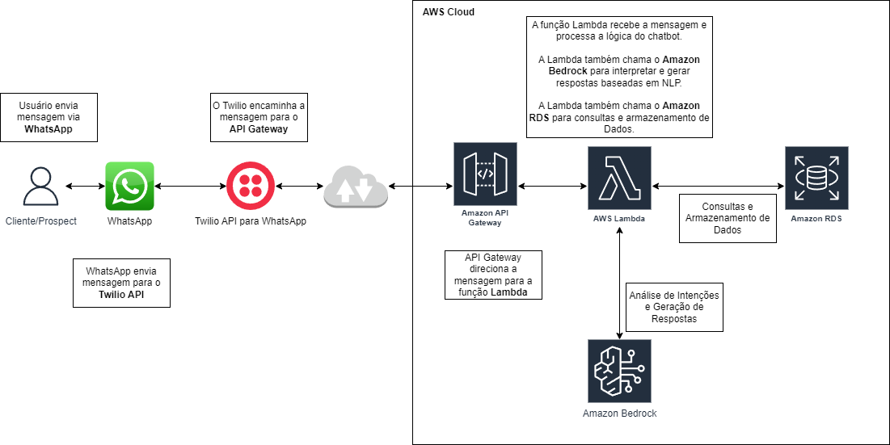

# FIAP - Faculdade de Informática e Administração Paulista

<p align="center">
<a href= "https://www.fiap.com.br/"></a>
</p>

<br>

# Chatbot Dra. Jô 

## Integrantes: 
- <a href="https://www.linkedin.com/in/joseandrefilho">Jose Andre Filho</a>

## Professores:
### Tutor
- <a href="https://www.linkedin.com/in/lucas-gomes-moreira-15a8452a/">Lucas Gomes Moreira</a>
### Coordenador
- <a href="https://www.linkedin.com/in/profandregodoi/">André Godoi Chiovato</a>

## 1. Objetivo do Projeto
O chatbot da Dra. Jô foi projetado para **automatizar o atendimento ao cliente** e fornecer suporte personalizado de forma rápida e eficaz. Seu objetivo principal é oferecer respostas precisas a perguntas frequentes e fornecer informações sobre produtos e serviços. Com potencial de expansão para agendamentos e vendas, o chatbot busca melhorar a eficiência do atendimento ao cliente.

### Escopo
As funcionalidades do chatbot foram detalhadas para atender a dois públicos principais:

- **Clientes**:
  - **Consultas Financeiras**: Permitir consultas sobre faturamento e status de pagamentos.
  - **Suporte Agronômico Especializado**: Oferecer informações e diagnósticos rápidos sobre manejo de lavoura.
  - **Assistência Técnica Direcionada**: Fornecer suporte técnico para solucionar dúvidas sobre o uso de produtos.

- **Prospects**:
  - **Facilitar o Primeiro Contato**: Fornecer informações iniciais sobre produtos e serviços para novos interessados.
  - **Atendimento Personalizado**: Identificar necessidades e sugerir soluções em bioinsumos.

Essas funcionalidades orientam as etapas de desenvolvimento do chatbot, assegurando que ele atenda tanto às necessidades dos clientes quanto dos prospects da SoluBio.

## 2. Tipo de Chatbot

O chatbot foi planejado com um enfoque avançado em **IA e Processamento de Linguagem Natural (NLP)**. Diferente de um chatbot baseado em regras, que oferece respostas predefinidas e limita as interações, o chatbot da Dra. Jô utiliza IA para compreender a linguagem natural e adaptar-se às interações dos usuários.

Para isso, optamos pelo **Amazon Bedrock (Amazon Q)**, uma tecnologia avançada de NLP que analisa as mensagens dos usuários e gera respostas personalizadas, permitindo uma experiência mais fluida e completa para o cliente.

## 3. Camadas da Arquitetura

A arquitetura do chatbot é composta por várias camadas, cada uma desempenhando um papel essencial para o funcionamento eficiente e seguro da solução.

### a) Interface de Usuário (Front-end)
A interface de comunicação com o usuário é o **WhatsApp**, integrado ao chatbot através da **API do Twilio**. O usuário interage diretamente pelo WhatsApp, onde envia perguntas e recebe respostas do chatbot.

### b) Motor de Processamento de Linguagem Natural (NLP)
O NLP é o “cérebro” do chatbot e utiliza o **Amazon Bedrock (Amazon Q)** para interpretar as mensagens dos usuários. Este serviço oferece compreensão avançada de linguagem e permite que o chatbot forneça respostas com base na intenção detectada, criando uma experiência personalizada e eficaz.

### c) Back-end (Processamento e Integração com Sistemas)
O back-end, desenvolvido em **AWS Lambda**, gerencia toda a lógica de negócio e integra-se com o NLP e o banco de dados. O Lambda processa as mensagens, consulta o banco de dados para informações adicionais e envia respostas através do Twilio para o usuário.

### d) Banco de Dados
O **Banco de Dados Oracle** hospedado no **Amazon RDS** armazena informações de interações, histórico de conversas e dados do usuário, permitindo que o chatbot personalize o atendimento e tenha uma visão contextual em tempo real.

### e) Infraestrutura
A solução é hospedada na **AWS Cloud Infrastructure**, proporcionando alta escalabilidade e segurança. Componentes de segurança como VPC, WAF e CloudTrail foram configurados para proteger dados e monitorar o sistema, garantindo conformidade com a LGPD.

## 4. Cuidados e Boas Práticas

### Dados de Treinamento e Manutenção
- Para garantir a qualidade das respostas, a arquitetura permite o uso de dados reais e sintéticos, que podem ser ajustados e expandidos conforme o chatbot evolui.
- O chatbot foi projetado para **aprendizado contínuo** e ajustes regulares, permitindo que novas intenções sejam adicionadas e as respostas sejam melhoradas conforme as interações reais com os usuários.

### Experiência do Usuário (UX)
- **Clareza e Objetividade**: Mensagens foram elaboradas para serem rápidas e úteis, evitando respostas vagas ou repetitivas.
- **Escalabilidade e Desempenho**: A arquitetura baseada em serverless (AWS Lambda) permite que o sistema escale conforme o crescimento de usuários, mantendo o desempenho estável mesmo em horários de pico.

### Privacidade e Segurança (LGPD)
- Toda a arquitetura foi projetada para atender às exigências da **LGPD**, garantindo que os dados dos usuários sejam tratados com segurança.
- A AWS fornece autenticação e autorização para controlar o acesso aos dados sensíveis do chatbot, incluindo o uso de VPC, WAF, e CloudTrail.

## 5. Tecnologias Envolvidas

### Back-end
- **AWS Lambda**: Serverless e escalável para execução da lógica do chatbot, economizando recursos e aumentando a eficiência.
  
### Processamento de Linguagem Natural (NLP)
- **Amazon Bedrock (Amazon Q)**: Análise de intenções dos usuários e geração de respostas com IA generativa, oferecendo uma experiência avançada e personalizada.

### Banco de Dados
- **Amazon RDS (Banco de Dados Oracle)**: Armazenamento seguro de dados de usuários e histórico de interações, proporcionando um atendimento contextualizado.

### Infraestrutura e Integração
- **Twilio API para WhatsApp**: Facilita a comunicação com os usuários via WhatsApp.
- **AWS API Gateway**: Gerencia o tráfego entre Twilio e Lambda, assegurando segurança e controle de acesso.
- **AWS Cloud (VPC, WAF, CloudTrail, CloudWatch)**: Serviços de infraestrutura para segurança, monitoramento e conformidade com a LGPD.

## 6. Diagrama de Arquitetura

Abaixo está o diagrama de arquitetura do chatbot da Dra. Jô, que ilustra os principais componentes e o fluxo de dados entre eles.




## 7. Previsão de Custos Mensais

Esta seção apresenta uma estimativa de custos mensais para cada serviço envolvido na solução do chatbot. Esses valores são aproximações e podem variar conforme o volume de uso, configuração e região onde os serviços estão configurados.

| Serviço                        | Função                                         | Custo Estimado      |
|--------------------------------|------------------------------------------------|----------------------|
| Twilio API para WhatsApp       | Comunicação com WhatsApp                       | $15-$30/mês         |
| AWS API Gateway                | Endpoint seguro para Lambda                    | $5-$10/mês          |
| AWS Lambda                     | Execução da lógica de chatbot                  | $10-$20/mês         |
| Amazon Bedrock (Amazon Q)      | Processamento de linguagem natural             | $20-$50/mês         |
| Amazon RDS (Oracle)            | Armazenamento de dados de usuário              | $20-$40/mês         |
| AWS Cloud Infrastructure       | Segurança e monitoramento                      | $10-$15/mês         |
| **Total Estimado**             |                                                | **$80-$165/mês**    |

### Detalhamento dos Custos e Justificativas

1. **Twilio API para WhatsApp**:
   - **Função**: Facilitar a comunicação entre o usuário e o chatbot, permitindo o envio e recebimento de mensagens via WhatsApp.
   - **Justificativa**: O custo do Twilio é baseado no número de mensagens enviadas e recebidas, além do valor do número de telefone.
   
2. **AWS API Gateway**:
   - **Função**: Gerenciar o tráfego entre o Twilio e o AWS Lambda, fornecendo um endpoint seguro para a comunicação.
   - **Justificativa**: O custo é baseado no número de requisições. O valor estimado é ideal para volume médio de uso.

3. **AWS Lambda**:
   - **Função**: Executar a lógica do chatbot, incluindo a integração com o NLP e o banco de dados.
   - **Justificativa**: Lambda cobra por execução e tempo de processamento, com custo ajustável conforme o uso do sistema.

4. **Amazon Bedrock (Amazon Q)**:
   - **Função**: Processamento de linguagem natural para entender as mensagens dos usuários e gerar respostas.
   - **Justificativa**: Amazon Bedrock cobra pelo uso do modelo NLP, e o custo pode variar conforme o volume de interações.

5. **Amazon RDS (Banco de Dados Oracle)**:
   - **Função**: Armazenar dados dos usuários e histórico de interações para atendimento personalizado.
   - **Justificativa**: Custo por tempo de instância, armazenamento e backup; valores ajustáveis conforme a necessidade.

6. **AWS Cloud Infrastructure (VPC, WAF, CloudWatch, CloudTrail)**:
   - **Função**: Proteção e monitoramento da infraestrutura.
   - **Justificativa**: VPC é gratuita para a maioria dos serviços, enquanto WAF e CloudWatch cobram conforme o uso. Ideal para segurança e conformidade com a LGPD.

### Variáveis que Podem Impactar os Custos

Os custos reais podem variar dependendo de:

- **Volume de Uso**: Mais consultas e mensagens aumentam os custos, especialmente no Twilio e no Amazon Bedrock.
- **Configurações de Armazenamento**: Alterações no tipo de instância ou armazenamento no RDS podem ajustar os custos.
- **Região Geográfica**: Preços podem variar conforme a região da AWS escolhida.

### Recomendações para Monitoramento e Controle de Custos

Para uma previsão mais precisa, utilize o [AWS Pricing Calculator](https://calculator.aws/#/) para simular o custo conforme as necessidades específicas do projeto. Também recomendamos monitorar o uso com o **AWS Cost Explorer** para identificar variações e ajustar as configurações conforme necessário.

## 8. Resultados Esperados e Benefícios para o Negócio

### Resultados Esperados

A implementação do chatbot da Dra. Jô trará os seguintes resultados para a empresa:

1. **Atendimento ao Cliente Automatizado e Eficiente**:
   - Respostas imediatas para dúvidas comuns, melhorando a experiência e agilidade do atendimento.

2. **Suporte Agronômico e Consultivo Especializado**:
   - Atendimento rápido e orientado para práticas de manejo e uso dos produtos, ampliando a fidelização dos clientes.

3. **Captação de Leads e Atendimento a Prospects**:
   - Facilitação do primeiro contato com prospects, identificando necessidades e gerando interesse nos produtos e serviços da SoluBio.

### Melhorias Esperadas para a Empresa

1. **Redução da Carga no Atendimento Humano**:
   - A automação reduz a carga de trabalho da equipe, que pode focar em questões mais complexas e estratégicas.

2. **Aumento na Eficiência Operacional**:
   - Respostas automatizadas e consultas financeiras mais rápidas, aumentando a satisfação do cliente.

3. **Otimização do Processo de Vendas**:
   - Atendimento inicial qualificado a prospects, facilitando o processo de vendas com leads preparados para a equipe comercial.

### Valores Agregados ao Modelo de Negócio

1. **Fidelização do Cliente**:
   - Atendimento acessível e rápido melhora a experiência e aumenta a fidelidade.

2. **Eficiência e Redução de Custos**:
   - A automação reduz os custos operacionais, pois o chatbot atende múltiplas consultas simultâneas sem aumento de custo proporcional.

3. **Escalabilidade do Atendimento**:
   - Atendimento ilimitado e escalável sem necessidade de novos recursos humanos.

4. **Dados e Insights para Melhorias Contínuas**:
   - Registro de interações permite análise de dados para entender melhor os clientes e adaptar o serviço às suas necessidades.

### Ganhos e Possíveis Perdas

#### Ganhos

1. **Melhoria na Satisfação do Cliente**:
   - Atendimento rápido e personalizado promove uma experiência positiva.

2. **Aumento na Conversão de Leads**:
   - Atendimento consultivo e personalizado aos prospects aumenta as chances de conversão.

3. **Redução no Tempo de Resposta e Maior Disponibilidade**:
   - Disponibilidade 24/7, garantindo suporte imediato fora do horário comercial.

#### Possíveis Perdas

1. **Custos Variáveis e Crescentes com o Uso**:
   - Com o aumento de uso, os custos operacionais com serviços como Amazon Bedrock e Twilio podem crescer proporcionalmente.

2. **Limitações na Personalização e Interações Complexas**:
   - O chatbot pode ter limitações para questões extremamente complexas, exigindo escalonamento para atendimento humano.

3. **Dependência de Serviços Externos**:
   - A dependência de serviços externos (Twilio, Amazon Bedrock) pode afetar a flexibilidade e o controle sobre o processo de atendimento no longo prazo.

---

Essa análise dos resultados e valores esperados permite uma visão clara dos benefícios e desafios, reforçando a proposta de valor e alinhando o projeto com as metas de crescimento e atendimento da empresa.


## 9. Estrutura do Repositório

```plaintext
/
├── assets/
│   ├── logo-fiap.png              # Logo da FIAP
├── docs/
│   ├── diagrama_chatbot.png       # Diagrama do chatbot no formato PNG
│   ├── diagrama_chatbot.drawio    # Diagrama do chatbot no formato drawio
├── README.md                      # Este arquivo
```

## Licença

<p xmlns:cc="http://creativecommons.org/ns#" xmlns:dct="http://purl.org/dc/terms/"><a property="dct:title" rel="cc:attributionURL" href="https://github.com/agodoi/template">MODELO GIT FIAP</a> por <a rel="cc:attributionURL dct:creator" property="cc:attributionName" href="https://fiap.com.br">Fiap</a> está licenciado sobre <a href="http://creativecommons.org/licenses/by/4.0/?ref=chooser-v1" target="_blank" rel="license noopener noreferrer" style="display:inline-block;">Attribution 4.0 International</a>.</p>

